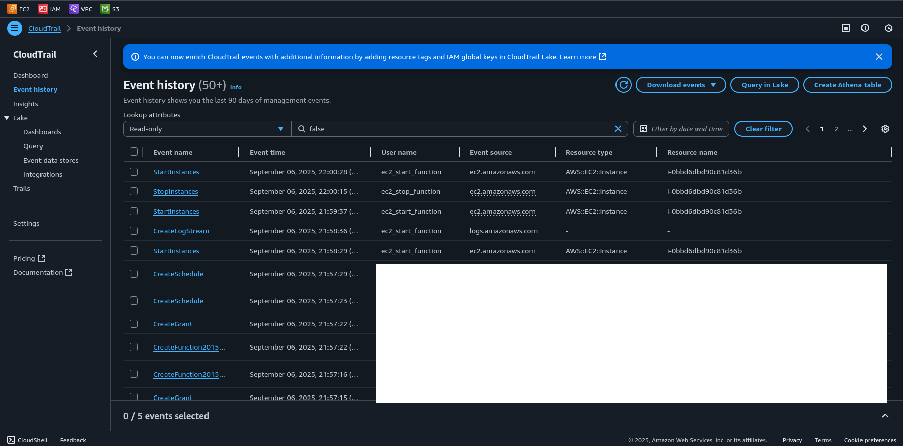

# Automated start and stop schedule for EC2 using Terraform and Lambda

This project based on the realworld use case. Therefore, you must have at least one existing ec2 instance before you test this project.

## Project diagram


### Steps
Follow these instructions to set up an automated ec2 start and stop schedule.

1. Open terminal
2. Setup your AWS IAM user using aws cli
```
aws configure
```
3. Clone this repo
```
git clone https://github.com/paingthu555/terraform-ec2-scheduling.git
```
4. Change to the project directory
```
cd terraform-ec2-scheduling
```
Note: Before you init the terraform, update the ec2 instance id and region in the both python code.

5. Initialize terraform
```
terraform init
```
6. Code validate
```
terraform validate
```
7. Terraform code dry-run
```
terraform plan
```
8. Deploy the infrastructure
```
terraform apply --auto-approve
```
Note: After running the terraform plan and apply command, you must enter your ec2 instance id and region.

## Confirm the deployment





